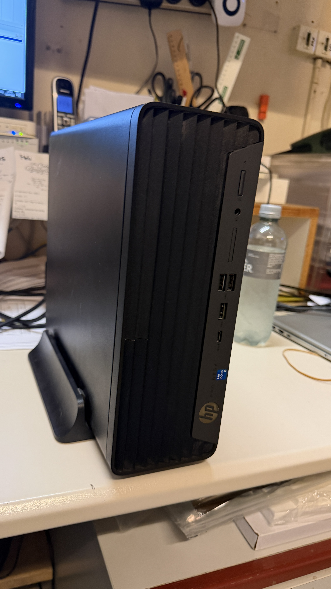
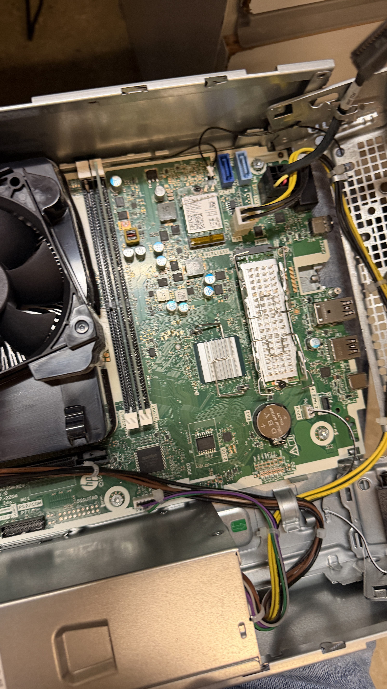
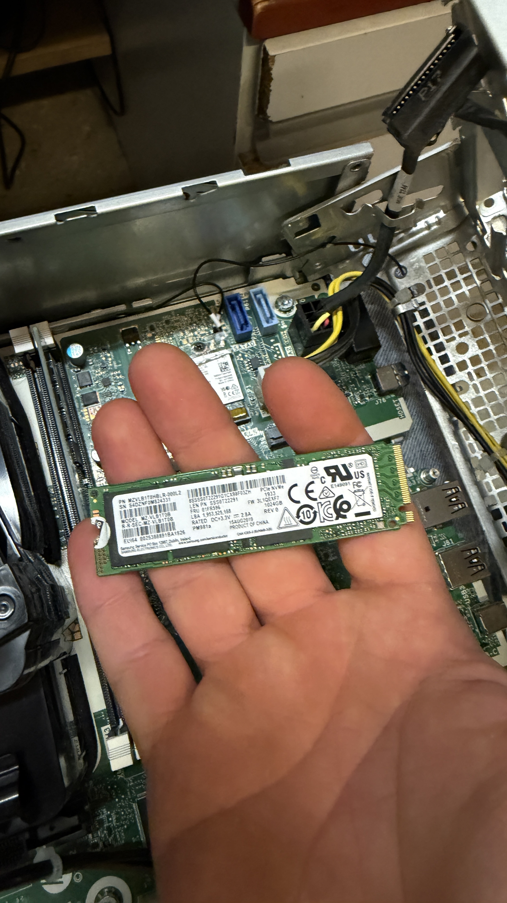
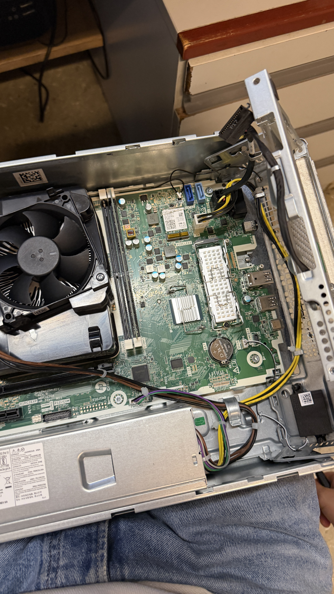
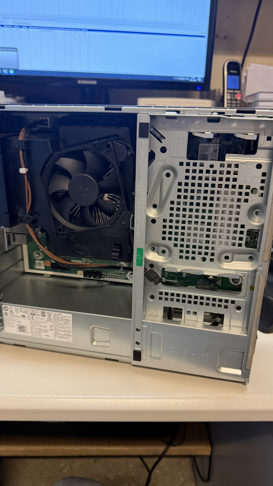
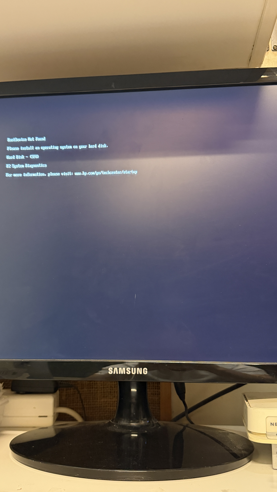
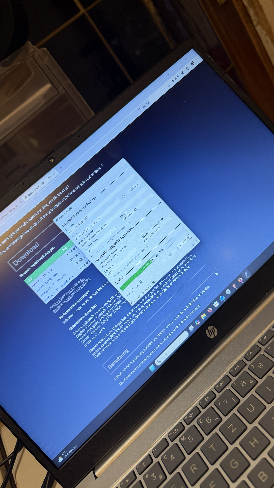
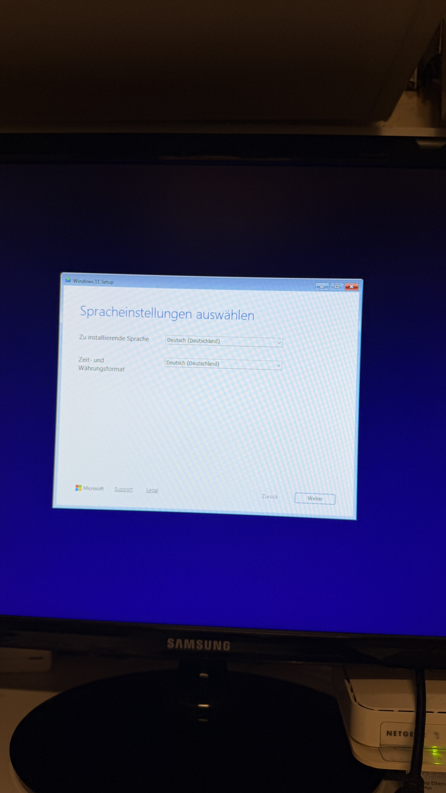
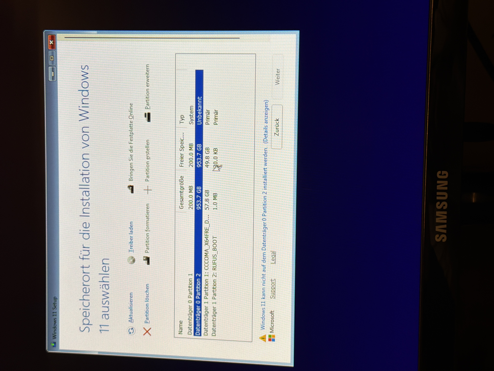
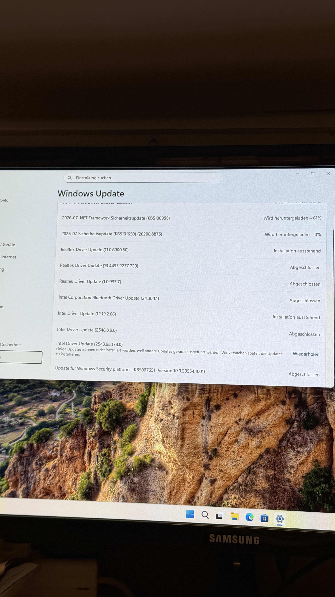

# HP ProDesk SFF – M.2 SSD Upgrade

Alte 500GB Platte im HP ProDesk SFF war mit BitLocker verschlüsselt, Recovery Key nicht mehr auffindbar. Statt lange danach zu suchen, hab ich mich für eine neue 1TB M.2 NVMe SSD entschieden und Windows 11 sauber neu installiert.



## Einbau

Gehäuse geöffnet, direkt neben den SATA-Anschlüssen war ein freier M.2-Slot auf dem Mainboard.



Neue Samsung NVMe SSD (1TB) eingesetzt.





Gehäuse wieder zusammengebaut.



## Boot-Problem

Nach dem Einbau kam beim Start nur:

```
BootDevice Not Found
Please install an operating system on your hard disk.
Hard Disk - (3F0)
```



War eigentlich normal, weil die SSD ja leer war – aber der USB-Stick zum Installieren hat auch nicht gebootet. Grund war Rufus: bei "Startart" stand "Nicht startfähig", obwohl sonst alles (GPT, UEFI) korrekt eingestellt war. Neu erstellt mit ISO direkt ausgewählt, Partitionsschema GPT, Zielsystem UEFI (ohne CSM), Dateisystem NTFS.



Danach hat der Stick über F9 (Boot-Menü bei HP) sauber gebootet.

## Windows Setup

Sprache auf Deutsch (Deutschland) gestellt.



Bei der Partitionsauswahl kam die Meldung, dass Windows nicht auf der SSD installiert werden kann (Partition als "Unbekannt" markiert). Beide vorhandenen Partitionen gelöscht, nur unzugeordneten Speicher übrig gelassen, Windows hat sich den Rest selbst angelegt.



Installation lief danach durch.

## Nach der Installation

Windows Update angestoßen – Sicherheitsupdates, Realtek- und Intel-Treiber automatisch nachgezogen.



## Alte SSD

Alte 500GB Platte liegt vorerst ausgebaut rum. Wird extern angeschlossen und mit `diskpart` → `clean` komplett gelöscht (Partitionstabelle inkl. BitLocker-Header weg, kein Recovery Key nötig dafür). Danach als externe Ablage weiterverwendbar.

## Learnings

- Rufus "Startart" immer prüfen – sonst sieht alles richtig konfiguriert aus, bootet aber trotzdem nicht.
- HP: Boot-Menü ist F9, nicht F12. BIOS ist F10.
- Partition als "Unbekannt" beim Windows-Setup → einfach löschen und Windows den Rest machen lassen.
- BitLocker ohne Key = Daten weg, Platte aber nach `clean` trotzdem normal weiterverwendbar.
